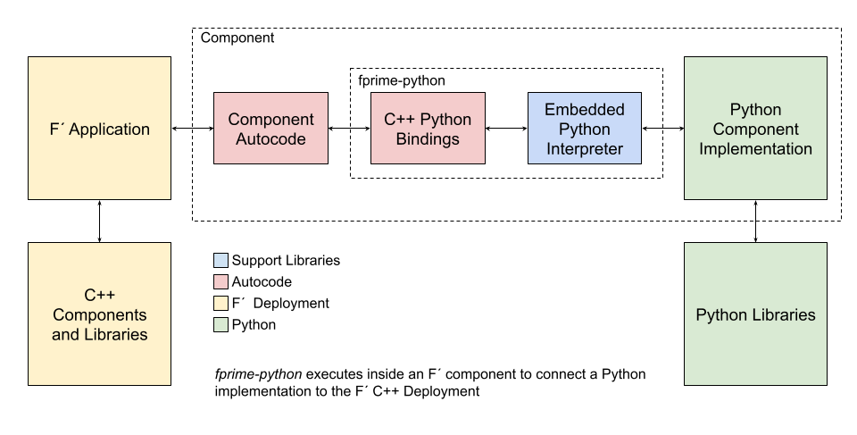

# fprime-python: F´ to Python Bindings

Once in a great blue moon, an fprime developer will find themselves in a bind: integrate into existing python code, or
incur the cost of translating that code into C++ before use. Since Python code is typically deployed as a prototype it
can be incredibly helpful to call it directly and defer the translation cost until after the project has left the
prototype phase.

This package allows F´ running as a C++ binary to call into F´ components defined in Python. These components implement
the functionality of F´ components while maintaining access to the Python environment itself.

fprime-python only supports v2.x.x versions of F´. Further support will be added as necessary to the maintainers.

**Acknowledgements:** [`pybind11`](https://github.com/pybind/pybind11) library helps quite a bit! Also thanks to Selina
Chu, JPL, for the initial suggestion to call embedded Python directly from F´.

**WARNING:** this is experimental without guarantee. I'll do my best to resolve issues when reported.

## What is fprime-python?

fprime-python expands F´ to allow:
- Wrapping of Python libraries in F´ Python Components
- Rapid prototyping of F´ components using Python
- Exploring F´ component implementation from a Python background

| What does fprime-python do?                  | What does fprime-python not do?                  |
|----------------------------------------------|--------------------------------------------------|
| Bridges F´ to Python                         | Reimplement F´ in Python nor remove existing C++ |
| Allows F´ component implementation in Python | Replace F´ components, ports                     |
| Exposes F´ types to Python                   |                                                  |

## Architecture

F´ python uses an embedded Python interpreter and a set of automatically generated C++/Python bindings to allow an F´
deployment to call out to an implementation written in python.  Essentially, bindings build on the F´ autocoder output
to extend the Component's implementation into the python ecosystem.  This is all handled through autocoding and support
libraries meaning the user need only mark components as implemented in python (see below).



Bindings are generated from the component's model and are built on the [`pybind11`](https://github.com/pybind/pybind11)
library, which handles the nuances of the Python API.

## Installation and Setup

In order to use `fprime-python` download the source code, or add it as a Git submodule.  Once finished, make sure to
pull int `pybind11` by running `git submodule update --init` in the `fprime-python` checkout.

Next, add the path to the download in the `library_locations` list set in settings.ini for a deployment. If
`fprime-python` is checked out parallel to the deployment directory then the following will work:

```ini
library_locations: ../fprime-python
```

Python 3 should be on the user's path and the same Python3 version should be run when executing the program. 


## Setting a Component Up With Python Bindings

In order to write a component in python, the component Ai.xml file and the Python implementation file must be registered
with the system. Add a call to `register_python_component(ai xml path, python file path)` to your CMakeLists.txt. This
must be done **after** the call to `register_fprime_module` which registers the component with F´´. For example:

```cmake
register_fprime_module()
...
register_python_component("${CMAKE_CURRENT_LIST_DIR}/SignalGenComponentAi.xml" "${CMAKE_CURRENT_LIST_DIR}/SignalGen.py")
```

Once finished, the python bindings will be autocoded and included in the next build (assuming the deployment is setup 
as shown below). This will also produce a `<component>.py.tmpl` file in the component folder as a basic template for
implementing components in python.

## Complex Data Types (Serializables, Arrays, Enums)

Other types are automatically supplied by the bindings autocoder, however; only types referenced in a component's model
(AI XML file) will be included. To use these types, reference:

```python
import <namespace>

var = <namespace>.typename()
```

Since these types are C++ class wrappers, one must be as pedantic when using them as one is in C++. It is best to
convert in/out of python data types close to the component interface and proceed with native python. An instructive
example with F´ types can be seen in the SignalGen reimplementation example found here:
[https://github.com/LeStarch/fprime-python-examples.git](https://github.com/LeStarch/fprime-python-examples.git)

## Deployments and Topologies

Deployments are required to add a few items to their `CMakeLists.txt` to properly pull in the `fprime-python` autocoder
and support code.  Take a note, the call to `register_fprime_target` must occur after the `FPrime.cmake` include call
and before the `FPrime-Code.cmake` include call.

```cmake
include("${FPRIME_FRAMEWORK_PATH}/cmake/FPrime.cmake")
register_fprime_target("<path to fprime-python>/cmake/target/pybind.cmake")

# NOTE: register custom targets between these two lines
include("${FPRIME_FRAMEWORK_PATH}/cmake/FPrime-Code.cmake")
include("<path to fprime-python>/fprime-python.cmake")
...
...
```

In addition, the user should add the following code to their `Main.cpp` file before calling F´ construction functions:

```c++
#include <fprime-python/FprimePy/FprimePy.hpp>

int main(int argc, char* argv[]) {
    FprimePy::initialize();
}
```

## Running a Python Bound Program

In short, the `build-artifacts/python` folder should be included on the PYTHONPATH. The autocoder build integration
will ensure the latest version of the automatically and hand coded python files are packaged there. This can be done
in the following ways:

The same version of python used to build should be available on the runtime path.

**Running the Raw Binary**

```
cd <deployment>/build-artifacts
PYTHONPATH=`pwd`/python ./bin/<executable> ...
```

**Running With `fprime-gds`**
```
cd <deployment>
PYTHONPATH=`pwd`/python fprime-gds
```

## A Working Example

A working example of SignalGen with a number of different types, commands, channels, events,
and schedule ports is available here:
[https://github.com/LeStarch/fprime-python-examples.git](https://github.com/LeStarch/fprime-python-examples.git)


Enjoy!

## Idiosyncrasies and Errors

```
libc++abi.dylib: terminating with uncaught exception of type pybind11::error_already_set: AttributeError:
```

If this error occurs on startup, or lists a Component as the missing attribute then it is likely you have not set your
PYTHONPATH correctly.  See "Running a Python Bound Program"


These are known missing features:

1. Parameter definitions are not supported
2. Extensive testing has not been done
